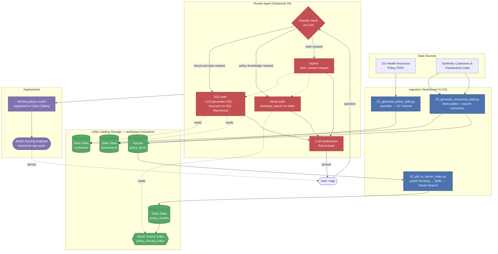

# Databricks RAG Project — Health Insurance Assistant

A production-style, multi-source **RAG (Retrieval-Augmented Generation)** agent built entirely on Databricks. It answers natural-language questions about health insurance by automatically deciding, per question, whether to:

- **search unstructured policy PDFs** (via Databricks Vector Search), or
- **query structured customer/transaction data** (via LLM-generated SQL against Delta tables), or
- **do both** and merge the context (hybrid).

The whole pipeline — PDF generation, chunking, vector indexing, structured data, routing logic, and deployment — runs on native Databricks components: Unity Catalog, Vector Search, Delta Lake, Foundation Model APIs, MLflow, and Model Serving.

---

## What problem this solves

Instead of hand-writing and maintaining a large number of Unity Catalog SQL functions to expose every possible query pattern to an LLM, this project uses a **single routing agent** that decides at query time which retrieval strategy fits the question, then dynamically generates the SQL or vector query it needs. That keeps the surface area small: two Delta tables, one vector index, one agent.

---

## Architecture

**Design principle:** the agent never needs a growing library of pre-defined UC functions. It has exactly two capabilities — *run a generated SQL query* and *run a vector similarity search* — and an LLM classification step decides which one(s) a given question needs.

---

## Components

| Layer | Component | Purpose |
|---|---|---|
| Storage | `workspace.insurance` (catalog.schema) | Home for all tables, volume, and index |
| Unstructured data | UC Volume `policy_docs/` | Raw PDF policy documents |
| Unstructured data | Delta table `policy_chunks` | Chunked PDF text + metadata (policy name, page, source file) |
| Unstructured data | Vector Search index `policy_chunks_index` | Delta Sync index, embeddings via `databricks-gte-large-en` |
| Structured data | Delta table `customers` | 80 synthetic policyholders, FK to policy_number |
| Structured data | Delta table `transactions` | 400 synthetic premium/claim/refund records |
| Reasoning | Foundation Model API | `databricks-meta-llama-3-3-70b-instruct` for classification, SQL generation, and answer synthesis |
| Orchestration | MLflow pyfunc model | `InsuranceRAGRouter`, registered as `workspace.insurance.insurance_rag_router` |
| Serving | Model Serving endpoint | `insurance-rag-router` (scale-to-zero enabled) |

---

## Sequence of jobs to run

Run the notebooks in this exact order — each phase depends on the Delta tables/objects created by the one before it.

| # | Notebook | What it does | Depends on |
|---|---|---|---|
| 1 | [`01_generate_policy_pdfs.py`](01_generate_policy_pdfs.py) | Generates 10 realistic health insurance policy PDFs (definitions, exclusions, benefit tables, FAQs) and writes them to a Unity Catalog Volume | — |
| 2 | [`02_pdf_to_vector_index.py`](02_pdf_to_vector_index.py) | Parses the PDFs, chunks the text, writes `policy_chunks` Delta table, creates the Vector Search endpoint + Delta Sync index, and runs test similarity queries | Step 1 |
| 3 | [`03_generate_structured_data.py`](03_generate_structured_data.py) | Generates synthetic `customers` and `transactions` Delta tables with policy-number foreign keys, adds column comments for LLM SQL-generation context | Step 1 (shares policy numbers) |
| 4 | [`04_rag_router_agent.py`](04_rag_router_agent.py) | Defines the `InsuranceRAGRouter` agent (classify → SQL / vector / hybrid → synthesize), runs a functional test, logs and registers the model to Unity Catalog | Steps 2 & 3 |
| — | *(manual, one-time)* | Deploy a Model Serving endpoint from the registered model version; grant `SELECT` on the two Delta tables to whatever identity the endpoint's SQL Warehouse resource runs as | Step 4 |

Notebooks 1 and 3 can run in parallel (no dependency between them); notebook 2 needs notebook 1's PDFs, and notebook 4 needs both 2 and 3 complete before its functional test will fully pass.

---

## Design reference

See [`00_project_prompt.md`](00_project_prompt.md) for the original phase-by-phase build specification this project was implemented against.

---

## Example questions

| Question | Routes to |
|---|---|
| "What is the waiting period for pre-existing diseases under the Family Floater policy?" | Vector search |
| "How many customers are on the Senior Citizen policy?" | SQL |
| "What is excluded under the Critical Illness policy?" | Vector search |
| "How much total claim payout has been made for the Diabetes Safe policy?" | SQL |
| "Is maternity covered, and how much has been paid out in claims so far?" | Hybrid (both) |

---

## Operational notes

- **Foundation model choice matters**: some premium-tier models may be rate-limited to 0 QPS on trial/sandbox workspaces. Verify your chosen `LLM_ENDPOINT` responds to a direct test query before wiring it into the agent.
- **Resource-vended auth covers compute, not data**: declaring `DatabricksSQLWarehouse` / `DatabricksVectorSearchIndex` as MLflow model `resources` grants the serving endpoint permission to *use* that compute, but Unity Catalog table-level `SELECT` grants must still be applied explicitly to whatever identity executes the query.
- All data in this project is **synthetic** — generated for demonstration purposes only, not real policyholder or claims data.
